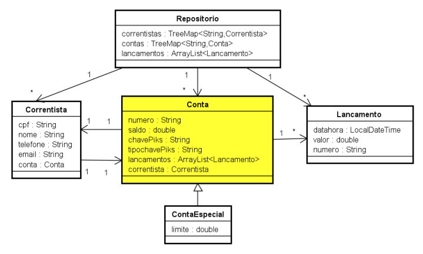

# Sistema _PIKS_
Segundo projeto da disciplina de programação orientada a objetos. Implementação de um sistema de transferência bancária inspirado no PIX.

## Descrição
Com o sistema PIKS qualquer pessoa pode fazer uma transferência bancária para outra pessoa, utilizando
a chave PIKS da conta destino, que pode ser dos quatro tipos: “cpf”, “email”, “telefone” ou “aleatorio”. Cada
transferência gera um lançamento de pagamento na conta origem e um lançamento de recebimento na
conta destino. Por segurança, cada conta deve manter um histórico dos seus lançamentos.

## Regras de negócio
1. Todo correntista é identificado pelo cpf.
2. Toda conta é identificada pela chave PIKS.
3. Todo lançamento é identificado pela datahora do computador.
4. Toda chave PIKS é única, ou seja, duas contas não podem ter a mesma chave.
5. As chaves dos tipos “cpf”, “email” e “telefone” devem ser validadas com os dados do correntista da
conta.
6. As chaves do tipo “aleatorio” devem ter uma cadeia de 8 dígitos (0 a 9) aleatórios, que é gerada pelo
sistema
7. A chave PIKS de uma conta pode ser substituida.
8. Um lançamento de pagamento na conta origem tem a datahora, o valor pago (negativo) e o número da
conta destino da transferência.
9. Um lançamento de recebimento na conta destino tem a datahora, o valor recebido (positivo) e o
número da conta origem da transferência.
10. As contas envolvidas na transferência devem ser diferentes.
11. Um conta com saldo 0 (zero) pode ser apagada juntamente com os seus lançamentos.
12. Uma conta especial pode ter saldo negativo (até o limite fornecido).

## Diagrama de classes

## Telas
- Tela Principal: contendo uma imagem de fundo, o menu “Conta” (submenus Criar, Alterar chave,
Apagar, Transferir) e o menu “repositorio.repositorio” (submenus Listar contas, Listar lancamentos)
- Tela de Criar Conta: campos para digitação dos dados da conta e correntista
- Tela de Criar Conta Especial: campos para digitação dos dados da conta e correntista + limite
- Tela de Criar Chave: campos para digitação do cpf e do tipo da chave
- Tela de Apagar Conta: campo para digitação do cpf
- Tela de Transferir: campo para digitação do cpf (origem) e da chave (destino) e valor
- Tela de Listar: uma única tela com uma área de texto, para todos as listagens

## Considerações finais:
- Desenvolver o sistema utilizando as camadas de aplicação, fachada, repositório e modelo
- Não se pode alterar os métodos da fachada
- A classe fachada deverá lançar Exception nos métodos que não conseguirem realizar suas tarefas
previstas
- Uma conta deve ser exibida junto com os dados do seu correntista e de todos os seus lançamentos
- Todas as telas devem ter um label destinado à exibição das mensagens ao usuário (de sucesso ou de
exceção que possam ocorrer)
- Na abertura da Tela Principal (evento windowsopened) deve ser feito o cadastro manual de 4 contas
(sendo 2 contas especiais), onde cada conta deve ter um tipo de chave diferente.
